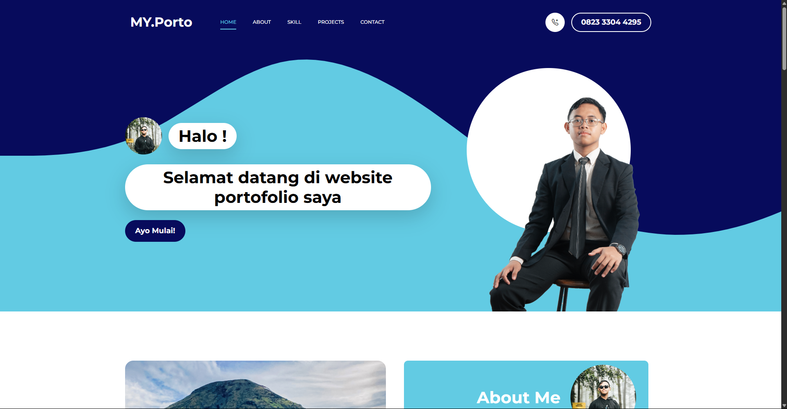
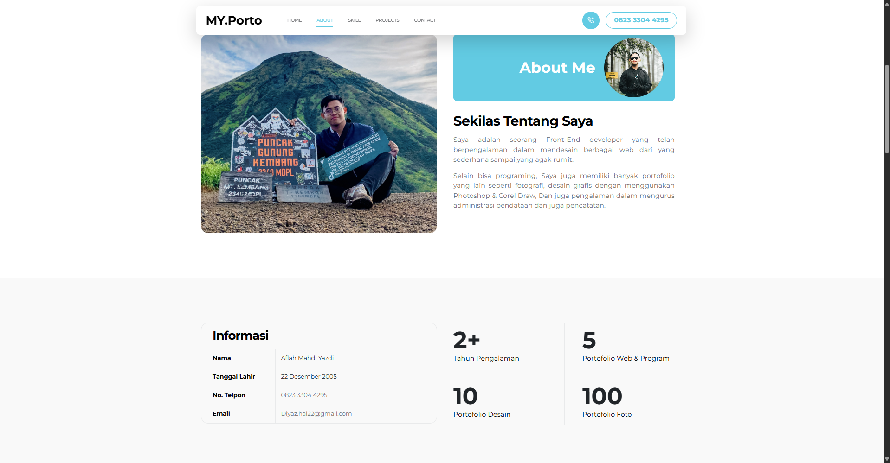
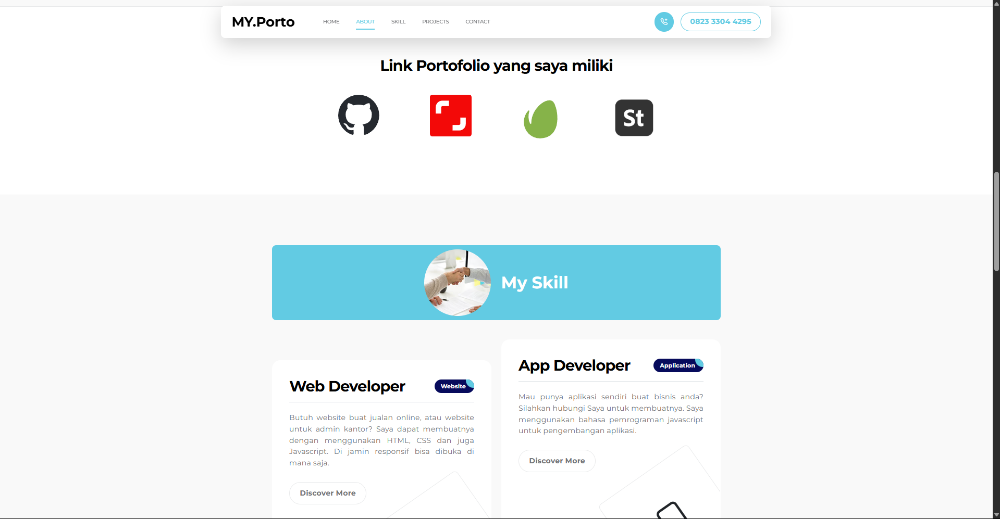
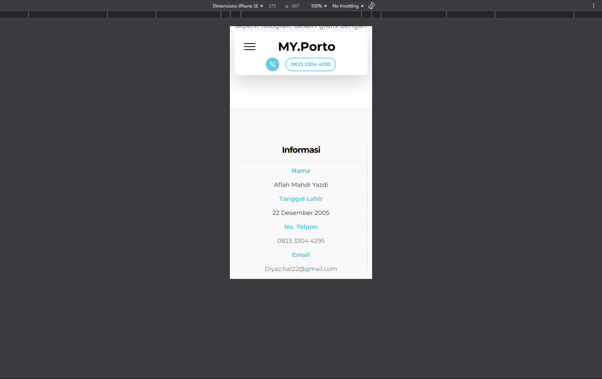

# MyPorto - Web Portofolio (Bootstrap Version)

Halo, Selamat datang di Dokumentasi Web Portofolio Perdana Saya
Ini merupakan web portofolio Pertama yang telah saya buat dengan menggunakan framework Bootstrap

## Framework yang digunakan

## Bahasa Pemrograman Yang di Gunakan

  

## Overview Web Ini

Web ini adalah web portofolio yang didalamnya terdapat pengenalan tentang diri saya dan juga data diri serta kontak saya.

Selain itu, web ini juga menjabarkan tentang kemampuan - kemampuan yang saya miliki baik itu pemrograman web, aplikasi, desain grafis dan juga fotografi.Di sini
juga ada link untuk mencari tahu tentang portofolio saya baik itu di Github ataupun Shutterstock.

Web ini sudah responsif sehingga tampilannya sudah bagus jika dibuka di smartphone maupun di dekstop.

